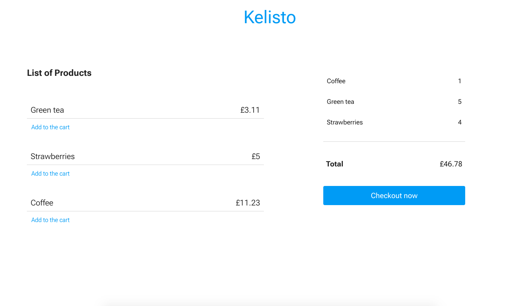

# Kefresh

React SPA that visualizes a Shopping Cart segment on a page

## Getting Started/ Installing

To ge the project up and running on local machine:

- download/clone repository
- open terminal:
  + `cd` to folder
  + type `npm install` to install dependencies
  + type `npm start` to open it in browser


### Prerequisites

- node
- npm


### Other

```


       Folders
       =======


     |  •Public

     |  •Src

     |  •Images

     |  •Styles --
     |           |--- Font.css
     |           |--- Base.css
     |           |--- Main.css
     |

     |  •Domain--|--- Data.js
     |           |--- List.js


     |  •UI -----|--- Components
     |           |              |--- Cart.js
     |           |              |--- Item.js
     |           |--- App.js
     |           |
     |
     |  •Index.js


```


- Build command  ------------  `npm run build`
- Lint/eslint command  ------  `npm run lint`
- Test command   ------------  `npm run test` - (started it)
- Coverage command     ------  `npm run cover`  - (started it)

<br /><br />


### Screenshots
---------------

<ktm>Desktop</ktm> <br />



<br /><br />

<ktm>Mobile</ktm> <br />


